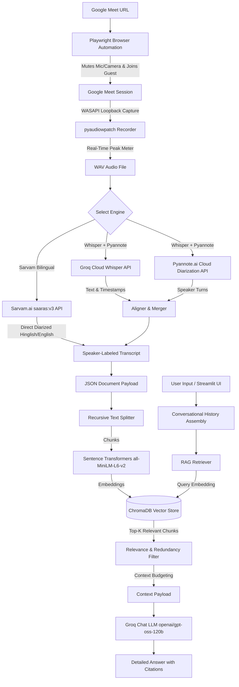

# 🎙️ Smart Meeting Bot & Conversational RAG Pipeline

An automated, end-to-end meeting recording, transcription, and Retrieval-Augmented Generation (RAG) system. This project automates joining a Google Meet, captures high-fidelity system-level meeting audio, runs state-of-the-art cloud transcription and speaker diarization, indexes the transcripts into a vector database, and hosts an interactive Streamlit chat interface to query specific meetings with source citations.

---

## 🏗️ Architecture & Data Flow

Below is the complete architectural diagram showing how audio is captured, processed, indexed, and queried:



---

## ✨ Key Features

### 🤖 1. Automated Google Meet Browser Bot
* **Headless/Headful Browser Automation:** Uses **Playwright** to launch a Chromium browser instance, navigate to the meet URL, and handle the pre-join environment.
* **Smart UI Interaction:** Automatically detects and dismisses Google Meet popups (e.g., *"Got it"*, *"Continue without microphone and camera"*).
* **Privacy-Safe Automation:** Programmatically disables the bot's local microphone and camera (via key shortcuts `Ctrl+D` / `Ctrl+E` and DOM selectors) before requesting to join.
* **Guest Admittance:** Enters custom name (`AI Meeting Bot`) and handles the *"Ask to Join"* or *"Join Now"* actions, waiting up to 2 minutes for the host to admit the bot.

### 🔊 2. System-Level Loopback Recording
* **WASAPI Loopback Capture:** Uses `pyaudiowpatch` to hook into the host system's Windows Audio Session API (WASAPI) and capture the exact audio stream played out of the speakers, ensuring clear speaker capture.
* **Live Peak Monitor:** Displays a live, animated volume peak bar in the terminal during recording (`SILENT` vs `AUDIO` status indicators) so you can verify that meeting audio is actually reaching the bot.
* **Auto-Scaling:** Automatically handles multi-channel audio, converts it to mono, normalizes peak volume, and exports it to a standard 16-bit PCM WAV format.

### ✍️ 3. Advanced Transcription & Speaker Diarization
The system provides two distinct transcription paths:
1. **Fully Cloud English Pipeline (Groq + Pyannote.ai):**
   * **Groq Whisper-large-v3:** Rapidly transcribes audio. To bypass Groq's file size limits, the audio is split into 5-minute chunks using `pydub` and processed in parallel.
   * **Rate-Limit & API Key Rotation:** Features a round-robin key manager (`GroqKeyManager`) that automatically rotates through multiple Groq API keys if rate limits or authentication errors occur.
   * **Pyannote.ai Cloud Diarization:** Uploads the audio to temporary cloud storage and submits a job to Pyannote's `precision-2` diarization engine to map timeframes to unique speaker identities (e.g., `SPEAKER_01`, `SPEAKER_02`).
   * **Segment Alignment:** Performs a binary search time-alignment matching transcription segments with speaker turns.
2. **Bilingual/Hinglish Pipeline (Sarvam AI):**
   * Uses Sarvam AI's `saaras:v3` model in `codemix` mode to handle meetings where participants speak a mix of English and Hindi (Hinglish).
   * Generates speaker-diarized outputs directly from a single API call.

### 🗄️ 4. Local Vector Ingestion (ChromaDB)
* **Metadata Extraction:** Extracts a list of meeting participants, starting timestamp, transcription engine, meeting ID, and custom titles.
* **Document Chunking:** Implements LangChain's `RecursiveCharacterTextSplitter` with customizable overlap parameters to break long meetings down into context-rich blocks.
* **Cosine Similarity Space:** Uses `SentenceTransformer` (`all-MiniLM-L6-v2`) to generate embeddings stored in a local, persistent **ChromaDB** instance configured with cosine distance.
* **Hash-based Deduplication:** Generates MD5 content hashes of chunks to prevent duplicate entries and maintain indexing integrity.

### 💬 5. Advanced RAG & Chat UI
* **Custom Chat Interface:** Streamlit-powered dashboard (`app2.py`) with meeting selection sidebars, history limits, search parameters, and debug toggles.
* **Recall & Precision Filtering:** Retrieves broad results (`retrieve_k = 12`) and filters them against a minimum cosine similarity score (`min_score = 0.25`) before selecting the top chunks (`final_k = 4`).
* **Source Attribution:** Shows exactly which parts of the transcript were retrieved, along with similarity scores and speaker names.
* **Strict Context Guidelines:** Implements the `MASTER_PROMPTT` contract instructing the LLM (`openai/gpt-oss-120b` via Groq) to only answer based on the provided transcript context and to say *"I don't know"* if the answer cannot be verified.

---

## 📂 Project Directory Structure

```bash
📂 clg rag/
├── 📄 meeting_bot.py            # Primary script: automates Playwright browser, records audio, transcribes, and triggers ingestion.
├── 📄 rag_pipeline.py           # Core RAG engine: manages Chunking, Embeddings (SentenceTransformers), ChromaDB Vector Store, and Groq LLM integration.
├── 📄 app2.py                   # Streamlit web application: provides interactive chat, adjustable sliders, and source visualization.
├── 📄 recover_meeting_ingest.py # Utility script: processes/re-processes existing meeting audio or transcripts, running CLI chats.
├── 📄 sarvam_transcribe.py      # Transcribes audio using the Sarvam AI API (optimized for Hinglish and bilingual code-mixing).
├── 📄 cloudtranscribe.py        # Transcribes and diarizes audio using Groq Whisper + Pyannote.ai Cloud.
├── 📄 ingest.py                 # Small driver script containing the standalone ingestion pipeline function.
├── 📄 meeting_library.py        # Helper utilities to manage local meeting directory metadata, folders, and JSON assets.
├── 📄 prompt.py                 # Holds the core system prompts (MASTER_PROMPTT) used to define LLM behavior.
├── 📄 requirements.txt          # Python dependencies list.
├── 📄 pyproject.toml            # Project package configuration and explicit version pins.
└── 📂 data/                     # Subdirectory where meetings, audio files, transcripts, and vector stores are saved.
    └── 📂 meetings/             # Unique meeting folders (contains WAV, transcripts, documents JSON, metadata, and local ChromaDB).
```

---

## 🛠️ Tech Stack & Requirements

| Layer | Technologies / Packages |
| :--- | :--- |
| **Automation** | Playwright (Python) |
| **Audio Capture** | PyAudioWPatch (WASAPI Loopback), SoundFile, Numpy, Pydub, FFMPEG |
| **STT & Diarization** | Groq API (Whisper-large-v3), Pyannote.ai Cloud API, Sarvam AI API |
| **Vector Database** | ChromaDB (Local Persistent Client, Cosine Space) |
| **Embeddings** | Sentence-Transformers (`all-MiniLM-L6-v2`) |
| **RAG Orchestration** | LangChain, LangChain Core, LangChain Community, LangChain Text Splitters |
| **LLM Inference** | ChatGroq (`openai/gpt-oss-120b` or custom models) |
| **User Interface** | Streamlit |

---

## 🚀 Getting Started

### 1. Installation

1. Ensure you have **Python 3.12+** installed.
2. Install the system dependency `ffmpeg` and ensure it is available on your system's `PATH`.
3. Install the project dependencies using `uv` (recommended) or `pip`:
   ```bash
   pip install -r requirements.txt
   ```
4. Install Playwright browser engines:
   ```bash
   playwright install chromium
   ```

### 2. Environment Setup

Create a `.env` file in the root directory of the project and populate the required API credentials:

```ini
# Groq API Configuration
GROQ_API_KEY=gsk_your_primary_groq_api_key_here
# comma-separated list of keys for transcription rotation (optional)
GROQ_Transcribe_API_KEY=gsk_transcribe_key_1,gsk_transcribe_key_2

# Pyannote.ai Cloud (Required for Diarization if using the English pipeline)
PYANNOTE_API_KEY=your_pyannote_api_key_here

# Sarvam AI API (Required if using the bilingual/Hinglish engine)
SARVAM_API_KEY=sk_your_sarvam_api_key_here
```

---

## 📖 Usage Instructions

### Run the Meeting Bot (Record, Transcribe & Ingest)

To launch the bot, direct it to a Google Meet, record the call, automatically transcribe it, and ingest the output into ChromaDB:

```bash
python meeting_bot.py "https://meet.google.com/abc-defg-hij"
```

1. **Browser Launch:** Playwright will open Chromium, navigate to the meet, configure audio/video rules, and join.
2. **Record:** Once admitted to the meeting, the audio recorder will initialize. Check the live audio meter in the terminal to verify active sound levels.
3. **Stop & Process:** When the meeting is finished, press **`Enter`** in the terminal. The bot will leave the call, save the WAV audio, contact the transcription APIs, generate a transcript JSON, and build the vector database.

---

### Start the Interactive Chat Dashboard (Streamlit)

Once you have recorded at least one meeting, launch the Streamlit app to chat with your meetings:

```bash
streamlit run app2.py
```

* **Sidebar Selector:** Select from a list of successfully processed meetings.
* **Chat Context Options:** Adjust parameters like strictness threshold, memory retrieval size, and prompt limits.
* **Excerpts:** Check the "Show retrieved transcript excerpts" checkbox to inspect exactly which lines of the transcript guided the LLM's response.

---

### Recover / Re-Ingest / CLI Chat

If you have a pre-existing meeting recording, or need to re-transcribe/re-index a folder without launching the browser, use the recovery script:

```bash
python recover_meeting_ingest.py
```

* Displays a numbered list of saved meetings found in `./data/meetings`.
* Lets you choose whether to re-transcribe from the raw audio WAV.
* Re-runs the vector store ingestion.
* Launches an interactive terminal-based chat session.
